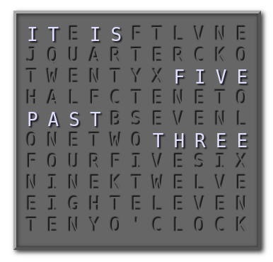

# Word Clock JQuery plugin

### --> [Live Demo](https://alexsartori.github.io/WordClock/) <--

## Instructions:

Include JS and CSS:

    
    <link rel="stylesheet" href="wordclock.css" />

Create a container:

    

Do the magic:

    $('#test').wordClock();

---
_Copyright 2017, Alex Sartori_
